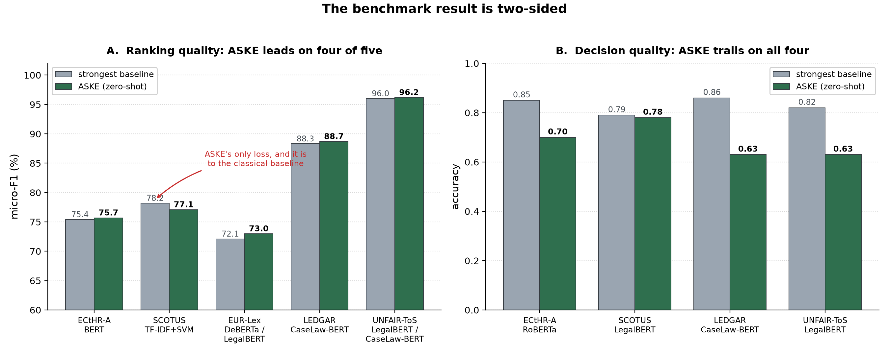
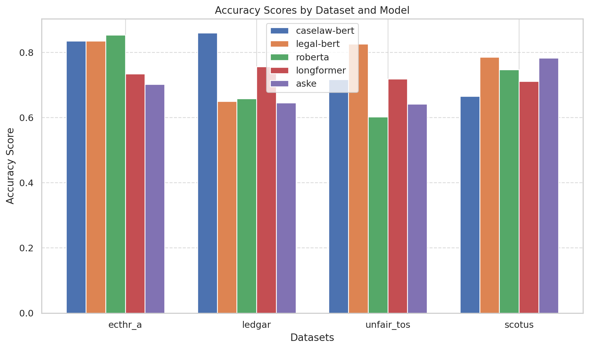

# ASKE benchmark — knowledge-based legal NLP against fine-tuned transformers

Evaluation code for the benchmark study of **ASKE** (Automated System for
Knowledge Extraction) on the LexGLUE suite, measured against supervised
transformer baselines.

> Khaliq, A. A., Riva, D., Montanelli, S. (2026). *Evaluating Knowledge-Based
> Approaches for Legal Text Analysis: A Benchmark Study.* Computer Law &
> Security Review **61**:106279. Elsevier.
> [doi:10.1016/j.clsr.2026.106279](https://doi.org/10.1016/j.clsr.2026.106279)

ASKE itself is not introduced here. It is the pipeline of
[Castano et al. (2024)](https://doi.org/10.1016/j.clsr.2024.105903), a five-stage
system combining context-aware embeddings, iterative concept extraction and
conceptual-graph augmentation into an ASKE Conceptual Graph that grows across
extraction generations. What this repository contributes is the evaluation: what
happens when that knowledge-based approach is put against transformers that were
fine-tuned on each task.

---

## The comparison is not like-for-like, and that is the point

**ASKE runs zero-shot. Every transformer baseline is fully fine-tuned on the
task it is scored on.** Read every number below with that asymmetry in view: a
zero-shot system matching a fine-tuned one is a different claim from one model
beating another under equal supervision.

---

## The result is two-sided



*Left: micro-F1, ASKE against the strongest baseline on each task. Right:
accuracy, same comparison. The two panels disagree, and that disagreement is the
finding.*

On **ranking quality**, measured by F1, ASKE leads four of five tasks and beats
the legal-domain transformers built for exactly this text. On **decision quality**,
measured by accuracy at its operating point, it trails on all four tasks where
accuracy was measured.

That is the shape of a zero-shot system judged against fine-tuned ones: it orders
candidates well and commits to them less well. A README showing only the F1 table
would present ASKE as uniformly state of the art, which the study does not claim.

---

## Results: micro- and macro-averaged F1 (%)

Best value in each column is bold.

| Model | ECtHR-A µ-F1 | ECtHR-A m-F1 | SCOTUS µ-F1 | SCOTUS m-F1 |
|---|---|---|---|---|
| TF-IDF + SVM | 69.6 | 58.4 | **78.2** | **69.5** |
| BERT | 75.4 | 68.6 | 68.3 | 58.3 |
| RoBERTa | 73.2 | 63.5 | 71.6 | 62.0 |
| DeBERTa | 74.0 | 66.9 | 71.1 | 62.7 |
| Longformer | 74.3 | 68.2 | 72.9 | 64.0 |
| BigBird | 74.4 | 66.9 | 72.8 | 62.0 |
| LegalBERT | 75.2 | 70.2 | 76.4 | 66.5 |
| CaseLaw-BERT | 74.7 | 66.8 | 76.6 | 65.9 |
| **ASKE** | **75.7** | **70.3** | 77.1 | 67.8 |

| Model | EUR-Lex µ-F1 | EUR-Lex m-F1 | LEDGAR µ-F1 | LEDGAR m-F1 | UNFAIR-ToS µ-F1 | UNFAIR-ToS m-F1 |
|---|---|---|---|---|---|---|
| TF-IDF + SVM | 71.3 | 51.4 | 87.2 | 82.4 | 95.4 | 78.8 |
| BERT | 71.4 | 57.2 | 87.6 | 81.8 | 95.6 | 81.3 |
| RoBERTa | 71.9 | 57.9 | 87.9 | 82.3 | 95.2 | 79.2 |
| DeBERTa | 72.1 | 57.4 | 88.2 | 83.1 | 95.5 | 80.3 |
| Longformer | 71.6 | 57.7 | 88.2 | 83.0 | 95.5 | 80.9 |
| BigBird | 71.5 | 56.8 | 87.8 | 82.6 | 95.7 | 81.3 |
| LegalBERT | 72.1 | 57.4 | 88.2 | 83.0 | 96.0 | 83.0 |
| CaseLaw-BERT | 70.7 | 56.6 | 88.3 | 83.0 | 96.0 | 82.3 |
| **ASKE** | **73.0** | **58.5** | **88.7** | **83.5** | **96.2** | **83.5** |

Two things worth noting rather than skipping past.

**SCOTUS goes to the classical baseline.** TF-IDF + SVM takes both SCOTUS columns
outright, ahead of ASKE and ahead of every transformer in the table. Among the
neural models ASKE leads, but the best model on that task is a bag of words.

**The margins are small.** On ECtHR-A, ASKE's 75.7 sits 0.3 above BERT; on
UNFAIR-ToS its 96.2 sits 0.2 above LegalBERT. These are single-run figures with no
seed variance reported, so the ordering within a point or so should not be read as
a reliable ranking.

---

## Results: accuracy



*Accuracy across the four datasets where it was measured, five models. Reproduced
from the benchmark study. Note this comparison is narrower than the F1 tables
above: four datasets and five models rather than five and nine, with EUR-Lex
absent.*

ASKE reaches 0.70 on ECtHR-A against RoBERTa's leading 0.85; 0.63 on LEDGAR
against CaseLaw-BERT's 0.86; 0.63 on UNFAIR-ToS against LegalBERT's 0.82; and 0.78
on SCOTUS, within 0.01 of LegalBERT's 0.79 and ahead of RoBERTa and CaseLaw-BERT.

**Accuracy is not comparable across these tasks.** They differ in class count and
in whether they are single- or multi-label, so top-one accuracy over LEDGAR's 100
classes is not commensurable with accuracy over SCOTUS's 14, and neither is
commensurable with exact-match accuracy on a multi-label task. The figures support
a within-task comparison between models, not a ranking of tasks.

It is worth recording that ASKE's *smallest* accuracy shortfall is on SCOTUS, the
most reasoning-intensive dataset in the suite, and its largest are on LEDGAR and
UNFAIR-ToS, the lexically driven clause tasks. The accuracy numbers therefore do
not on their own isolate a reasoning deficit.

---

## Extraction quality

The study additionally reports *pseudo*-precision and *pseudo*-recall, which
measure how closely the knowledge ASKE extracts matches ground truth rather than
how well it classifies. ASKE reaches 0.83 precision on LEDGAR, comparable to
RoBERTa (0.85) and ahead of LegalBERT (0.82), CaseLaw-BERT (0.76) and Longformer
(0.71), at the lowest recall of any model in the comparison.

That is a high-precision, low-recall extraction profile. It is **not commensurable
with the classification F1 above**: harmonising those two values gives roughly
0.71, well below the 88.7 µ-F1 reported for LEDGAR, because the two metrics
measure different things.

---

## Tasks and datasets

All from [LexGLUE](https://huggingface.co/datasets/lex_glue) (Chalkidis et al.).

| Dataset | Sub-domain | Task | Train / Dev / Test | Classes |
|---|---|---|---|---|
| ECtHR Task A | ECHR case law | Multi-label | 9K / 1K / 1K | 10+1 |
| SCOTUS | US case law | Multi-class | 5K / 1.4K / 1.4K | 14 |
| EUR-Lex | EU law | Multi-label | 55K / 5K / 5K | 100 |
| LEDGAR | US contracts | Multi-class | 60K / 10K / 10K | 100 |
| UNFAIR-ToS | Consumer contracts | Multi-label | 5.5K / 2.2K / 1.6K | 8+1 |

---

## What this code runs, and what it does not

`scripts/run_benchmark.py` covers **four datasets** (`ecthr_a`, `ledgar`,
`unfair_tos`, `scotus`) and **four transformer baselines** (LegalBERT, RoBERTa,
SBERT, Longformer) alongside ASKE. It is what produced the accuracy and
precision/recall figures.

The nine-model F1 tables above are **not** all reproduced by this script. The
TF-IDF + SVM, BERT, DeBERTa, BigBird and CaseLaw-BERT rows are the published
LexGLUE baselines, carried over for comparison rather than re-run here.

---

## Layout

```
src/
  aske.py        the ASKE pipeline: chunking, zero-shot classification,
                 terminology enrichment, concept derivation by affinity
                 propagation over term embeddings
  benchmark.py   per-dataset harness; fine-tunes each baseline, evaluates ASKE
  trainer.py     HuggingFace Trainer subclass with a multi-label BCE loss path
  utils.py       chunk-to-document mapping, metrics, result persistence
scripts/
  run_benchmark.py   entry point; loads datasets, runs everything, writes JSON
figures/           the figures used above
requirements.txt
```

---

## Running it

```bash
pip install -r requirements.txt
python -m scripts.run_benchmark
```

Datasets are pulled from the HuggingFace `lex_glue` hub at run time, so no manual
download is needed. Results accumulate into JSON and are reloaded on restart, so
an interrupted run resumes rather than starting over.

The default embedding model is `paraphrase-multilingual-MiniLM-L12-v2`, with
`alpha = beta = 0.3` and a 512-word chunk size (`src/aske.py`).

---

## Limitations

- **English only.** Transfer to multilingual or cross-jurisdictional corpora is
  untested, and the multilingual embedding model in the default configuration
  should not be read as evidence of multilingual capability.
- **Single runs.** No seed variance is reported, and several margins in the F1
  tables are smaller than the spread one would expect across seeds.
- **Asymmetric supervision.** Zero-shot against fine-tuned, as described above.
- **Accuracy is within-task only.** Class counts and label structures differ.
- The study's own limitations section reads the shortfall as a reasoning one,
  attributing it to tasks "that require advanced reasoning or argumentation on
  articulated legal texts". That is an interpretation offered by the authors
  rather than a measurement the benchmark makes.

---

## Citation

```bibtex
@article{khaliq2026benchmark,
  title   = {Evaluating Knowledge-Based Approaches for Legal Text Analysis:
             A Benchmark Study},
  author  = {Khaliq, Awais Abdul and Riva, Davide and Montanelli, Stefano},
  journal = {Computer Law and Security Review},
  volume  = {61},
  pages   = {106279},
  year    = {2026},
  doi     = {10.1016/j.clsr.2026.106279},
  publisher = {Elsevier}
}
```

For the ASKE pipeline itself, cite Castano et al.:

```bibtex
@article{castano2024aske,
  title   = {Enforcing legal information extraction through context-aware
             techniques: The ASKE approach},
  author  = {Castano, Silvana and Ferrara, Alfio and Furiosi, Emanuela and
             Montanelli, Stefano and Picascia, Sergio and Riva, Davide and
             Stefanetti, Carolina},
  journal = {Computer Law and Security Review},
  volume  = {52},
  pages   = {105903},
  year    = {2024},
  publisher = {Elsevier}
}
```

---

## Related

This benchmark is Chapter 4 of the author's doctoral thesis, where its two-sided
result is the empirical starting point for a defeasibility-aware investigation.
That work is at
[`oziofficial5/jusdefv2`](https://github.com/oziofficial5/jusdefv2).

---

## Licence

MIT, see [`LICENSE`](LICENSE). Dataset licences are those of LexGLUE and its
constituent corpora.

---

## Contact

Awais Abdul Khaliq, Dipartimento di Informatica "Giovanni Degli Antoni",
Università degli Studi di Milano.
ORCID [0000-0002-3439-6256](https://orcid.org/0000-0002-3439-6256)
